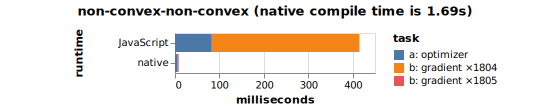
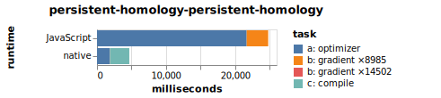

# 2022 Optimizer Performance

author: [**@samestep**](http://github.com/samestep)

This experiment is an attempt to get an idea of how much faster the Penrose
optimizer could possibly be, without fundamentally changing how it works.
Specifically, I naïvely rewrote the optimizer in Rust (i.e. direct translation,
nothing clever) and modified our autodiff code generator to produce C code
instead of JavaScript. I also added a counter to the optimizer to see how many
times it called the generated gradient function. Then I timed both the original
JavaScript optimizer and the native optimizer (including the time it takes to
actually compile the Rust and generated C code) and compared them, in each case
separating out the total time it takes to call the generated gradient function
from the time spent in the rest of the optimizer.

## Results

Not including the time it takes to compile the C and Rust code, the native
optimizer is consistently 1-2 orders of magnitude faster. Compilation time often
dominates (in which case it is not shown as an explicit bar in the chart), but
not always.

### MacBook Pro (13-inch, M1, 2020)








## Prerequisites

- [Node](https://nodejs.org/en/download/)
- [Rust](https://www.rust-lang.org/tools/install)
- [Yarn](https://classic.yarnpkg.com/lang/en/docs/install/)

## Usage

All commands in this README assume your working directory is the directory
containing this README. You'll first need to clone the Penrose repo submodule:

```sh
git submodule update penrose
```

This experiment requires some changes to the Penrose repo, stored in
`penrose.patch`. To apply those changes, run this command:

```sh
git -C penrose apply ../penrose.patch
```

Then to build and run the experiment, run this command:

```sh
./run.sh
```

Results should appear in the `results/` folder.

## Development

If you make further changes and want to re-export them to the patch file, run
this command:

```sh
git -C penrose diff > penrose.patch
```

To clear changes to the Penrose repo (for instance, if you want to freshly
re-apply `penrose.patch`):

```sh
git -C penrose restore .
```

After running the experiment, if you want to verify that the Rust version of the
optimizer actually worked correctly, run this to regenerate `penrose/diagrams/`:

```sh
./render.sh
```

Once you're satisfied looking at the diagrams, you'll probably want to restore
them in case you're planning to use the above command to update `penrose.patch`:

```sh
git -C penrose restore diagrams
```
